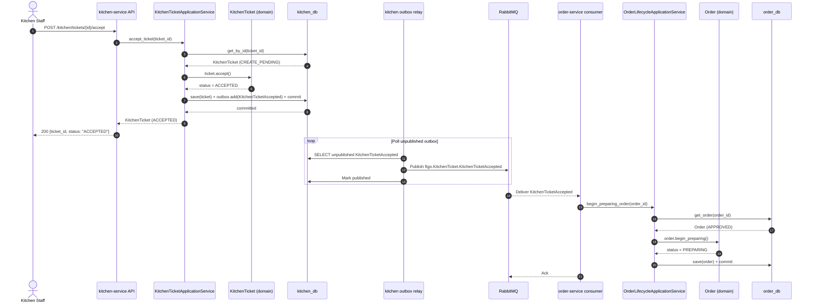

# Design Document: Kitchen Ticket Acceptance

## Overview

This feature closes the loop between `kitchen-service` and `order-service` after a kitchen ticket is created. Kitchen staff accept or reject a ticket via two new REST endpoints. Each operation drives a domain state transition on `KitchenTicket`, writes the corresponding domain event to the transactional outbox atomically, and publishes it to RabbitMQ. `order-service` consumes both events and drives its own `Order` state machine forward: accepted tickets move the order to `PREPARING`; rejected tickets cancel the order.

The implementation extends two existing, independently deployed services. Both services already use the transactional outbox pattern, DDD-style layering, and the same RabbitMQ `ftgo.events` topic exchange. This feature adds two new routing keys, two new outbox event builders, and one new order status (`PREPARING`) while leaving all existing behaviour unchanged.

### Key Design Decisions

- **No new `reject()` method needed in the kitchen domain**: The existing `KitchenTicket` domain model already has `accept()` (which transitions `CREATE_PENDING → ACCEPTED`) but is missing a `reject()` method. We add `reject()` to complement it, following the exact same idempotency and error-raising pattern.
- **`accept_ticket()` already exists but is incomplete**: The application service method `accept_ticket()` already performs the status transition and commit but does not write to the outbox. We fix this gap as part of this feature.
- **`Order.cancel()` already covers `APPROVED` and `PENDING`**: We extend it to also accept `PREPARING` as a valid source status per Requirement 8.4, making the transition set `{PENDING, APPROVED, PREPARING} → CANCELLED`.
- **`Order.begin_preparing()` is a new method**: It enforces `APPROVED → PREPARING` with idempotency on `PREPARING` and raises `InvalidOrderStatusTransitionError` for any other source status.
- **`order-service` consumer is refactored, not replaced**: The existing `consumer.py` in `order-service` handles only `KitchenTicketCreated`. We extend it to also bind and handle `KitchenTicketAccepted` and `KitchenTicketRejected` on the same channel.
- **Alembic migration adds `PREPARING` to `order_status` PostgreSQL enum**: PostgreSQL requires `ALTER TYPE … ADD VALUE` to extend an existing enum type. This is done in a new migration (`0005_add_preparing_to_order_status.py`).

---

## Architecture

The feature spans two services and the shared RabbitMQ broker. There are no changes to `libs/common/` or any other service.



The reject flow mirrors the accept flow, replacing `accept()` / `KitchenTicketAccepted` / `begin_preparing_order()` with `reject()` / `KitchenTicketRejected` / `cancel_order()`. The `cancel_order()` call re-uses the existing `cancel()` domain method, extended to also accept `PREPARING` as a valid source.

---

## Components and Interfaces

### kitchen-service

#### `domain/models.py` — KitchenTicket

Add a `reject()` method following the same guard pattern as `accept()`:

```python
def reject(self) -> None:
    if self.status == KitchenTicketStatus.CANCELLED:
        return
    if self.status != KitchenTicketStatus.CREATE_PENDING:
        raise InvalidKitchenTicketStatusTransitionError(
            self.status, KitchenTicketStatus.CANCELLED
        )
    self.status = KitchenTicketStatus.CANCELLED
```

No new status values are needed in `KitchenTicketStatus`: `ACCEPTED` and `CANCELLED` already exist.

#### `application/outbox.py` — Event Builders

Add two new builder functions alongside the existing `kitchen_ticket_created_event`:

```python
def kitchen_ticket_accepted_event(ticket: KitchenTicket) -> OutboxEvent:
    return OutboxEvent(
        aggregate_type="KitchenTicket",
        aggregate_id=str(ticket.id),
        event_type="KitchenTicketAccepted",
        payload={
            "ticket_id": str(ticket.id),
            "order_id": str(ticket.order_id),
            "restaurant_id": ticket.restaurant_id,
            "status": ticket.status.value,
        },
    )

def kitchen_ticket_rejected_event(
    ticket: KitchenTicket,
    rejection_reason: str | None = None,
) -> OutboxEvent:
    payload: dict[str, Any] = {
        "ticket_id": str(ticket.id),
        "order_id": str(ticket.order_id),
        "restaurant_id": ticket.restaurant_id,
        "status": ticket.status.value,
    }
    if rejection_reason is not None:
        payload["rejection_reason"] = rejection_reason
    return OutboxEvent(
        aggregate_type="KitchenTicket",
        aggregate_id=str(ticket.id),
        event_type="KitchenTicketRejected",
        payload=payload,
    )
```

#### `application/commands.py` — New Commands

```python
@dataclass(slots=True)
class AcceptKitchenTicketCommand:
    ticket_id: UUID

@dataclass(slots=True)
class RejectKitchenTicketCommand:
    ticket_id: UUID
    rejection_reason: str | None = None
```

#### `application/tickets.py` — Application Service Methods

Fix `accept_ticket()` to write to the outbox (currently missing), and add `reject_ticket()`:

```python
def accept_ticket(self, ticket_id: UUID) -> KitchenTicket | None:
    ticket = self.ticket_repository.get_by_id(ticket_id)
    if ticket is None:
        return None
    if ticket.status == KitchenTicketStatus.ACCEPTED:
        return ticket  # idempotent — no new outbox event
    ticket.accept()  # raises InvalidKitchenTicketStatusTransitionError on bad transition
    saved = self.ticket_repository.save(ticket)
    self.outbox.add(kitchen_ticket_accepted_event(saved))
    self.unit_of_work.commit()
    return saved

def reject_ticket(
    self,
    ticket_id: UUID,
    rejection_reason: str | None = None,
) -> KitchenTicket | None:
    ticket = self.ticket_repository.get_by_id(ticket_id)
    if ticket is None:
        return None
    if ticket.status == KitchenTicketStatus.CANCELLED:
        return ticket  # idempotent — no new outbox event
    ticket.reject()  # raises InvalidKitchenTicketStatusTransitionError on bad transition
    saved = self.ticket_repository.save(ticket)
    self.outbox.add(kitchen_ticket_rejected_event(saved, rejection_reason))
    self.unit_of_work.commit()
    return saved
```

The idempotency guard lives in the **application service**, not in the domain method. The domain's `accept()` and `reject()` return silently when the status already matches the target (Requirement 3.3). The application service exploits this to avoid writing a duplicate outbox entry—it checks before calling the domain method and returns early if the ticket is already in the target state.

#### `api/routes/tickets.py` — New Endpoints

Add the two new routes to the existing `tickets.py` router:

```python
@router.post("/{ticket_id}/reject", response_model=KitchenTicketRead)
def reject_ticket(
    ticket_id: UUID,
    service: Annotated[KitchenTicketApplicationService, Depends(get_ticket_service)],
) -> KitchenTicketRead:
    try:
        ticket = service.reject_ticket(ticket_id)
    except InvalidKitchenTicketStatusTransitionError as exc:
        raise HTTPException(
            status_code=409,
            detail={"message": str(exc), "current_status": exc.current, "target_status": exc.target},
        ) from exc
    if ticket is None:
        raise HTTPException(status_code=404, detail="Kitchen ticket not found")
    return to_ticket_read(ticket)
```

The existing `/accept` route also needs to be updated to include the outbox write (currently the route calls the incomplete `accept_ticket()`). Its signature and response shape remain unchanged.

The `409` response body already exposes `current_status` and `target_status` through `InvalidKitchenTicketStatusTransitionError.current` and `.target`, satisfying Requirement 1.4 and 2.4.

---

### order-service

#### `domain/models.py` — Order

Add `PREPARING` to `OrderStatus` and add `begin_preparing()`:

```python
class OrderStatus(StrEnum):
    PENDING = "PENDING"
    APPROVED = "APPROVED"
    REJECTED = "REJECTED"
    CANCELLED = "CANCELLED"
    PREPARING = "PREPARING"   # new
```

```python
def begin_preparing(self) -> None:
    if self.status == OrderStatus.PREPARING:
        return
    if self.status != OrderStatus.APPROVED:
        raise InvalidOrderStatusTransitionError(self.status, OrderStatus.PREPARING)
    self.status = OrderStatus.PREPARING
```

Extend `cancel()` to accept `PREPARING` as a valid source:

```python
def cancel(self) -> None:
    if self.status == OrderStatus.CANCELLED:
        return
    if self.status not in {OrderStatus.PENDING, OrderStatus.APPROVED, OrderStatus.PREPARING}:
        raise InvalidOrderStatusTransitionError(self.status, OrderStatus.CANCELLED)
    self.status = OrderStatus.CANCELLED
```

#### `application/lifecycle.py` — OrderLifecycleApplicationService

Add `begin_preparing_order()` alongside the existing `approve_order()`:

```python
def begin_preparing_order(self, order_id: UUID) -> Order | None:
    order = self.order_repository.get_order(order_id)
    if order is None:
        return None
    order.begin_preparing()
    saved_order = self.order_repository.save(order)
    self.unit_of_work.commit()
    return saved_order

def cancel_order(self, order_id: UUID) -> Order | None:
    order = self.order_repository.get_order(order_id)
    if order is None:
        return None
    order.cancel()
    saved_order = self.order_repository.save(order)
    self.unit_of_work.commit()
    return saved_order
```

`cancel_order()` is a new convenience wrapper—the existing consumer calls `approve_order()` directly; we follow the same pattern for consistency.

#### `consumer.py` — Extended Message Handler

The existing consumer binds one queue to one routing key. We extend it to handle three routing keys with separate handlers, all on the same channel:

```python
async def handle_kitchen_ticket_accepted(message: IncomingMessage) -> None:
    async with message.process(requeue=False):
        envelope = json.loads(message.body.decode())
        payload = envelope["payload"]
        order_id_str = payload.get("order_id")
        if not order_id_str:
            logger.error("KitchenTicketAccepted missing order_id: %s", envelope)
            return
        try:
            order_id = UUID(order_id_str)
        except ValueError:
            logger.error("KitchenTicketAccepted has invalid order_id: %s", order_id_str)
            return
        session = SessionLocal()
        try:
            service = OrderLifecycleApplicationService(
                order_repository=SqlAlchemyOrderRepository(session),
                unit_of_work=SqlAlchemyUnitOfWork(session),
            )
            try:
                order = service.begin_preparing_order(order_id)
            except InvalidOrderStatusTransitionError as exc:
                logger.error("Cannot begin_preparing order %s: %s", order_id, exc)
                return
            if order is None:
                logger.warning("Order %s not found for KitchenTicketAccepted", order_id)
                return
            logger.info("Order %s transitioned to %s", order.id, order.status.value)
        finally:
            session.close()
```

The `requeue=False` in `message.process()` means that if a `session.commit()` raises, the exception propagates out of the `async with` block, which causes aio-pika to **nack** the message and requeue it (per Requirement 6.6). For domain errors and missing orders, we return normally so the message is **acked** without requeueing.

The `KitchenTicketRejected` handler follows the same pattern but calls `service.cancel_order(order_id)`.

Queues and bindings to add in the `consume()` setup:

```python
queue_accepted = await channel.declare_queue("order.kitchen-ticket-accepted", durable=True)
await queue_accepted.bind(exchange, routing_key="ftgo.KitchenTicket.KitchenTicketAccepted")
await queue_accepted.consume(handle_kitchen_ticket_accepted)

queue_rejected = await channel.declare_queue("order.kitchen-ticket-rejected", durable=True)
await queue_rejected.bind(exchange, routing_key="ftgo.KitchenTicket.KitchenTicketRejected")
await queue_rejected.consume(handle_kitchen_ticket_rejected)
```

#### `infrastructure/db/models.py` — ORM

The `OrderRecord.status` column uses `Enum(OrderStatus, name="order_status")`. Adding `PREPARING` to the `OrderStatus` StrEnum automatically makes the SQLAlchemy model aware of it. The PostgreSQL enum type itself must be extended via Alembic migration.

#### Alembic Migration — `0005_add_preparing_to_order_status.py`

PostgreSQL `ALTER TYPE … ADD VALUE` cannot run inside a transaction block. Alembic handles this with `op.execute()` outside a transaction:

```python
def upgrade() -> None:
    op.execute("ALTER TYPE order_status ADD VALUE IF NOT EXISTS 'PREPARING'")

def downgrade() -> None:
    # Removing an enum value in PostgreSQL requires recreating the type.
    # Omitted for simplicity; coordinate with a full rollback plan if needed.
    pass
```

---

## Data Models

### KitchenTicket status transitions (complete picture after this feature)

```
CREATE_PENDING ──accept()──► ACCEPTED ──start_preparing()──► PREPARING ──mark_ready_for_pickup()──► READY_FOR_PICKUP
CREATE_PENDING ──reject()──► CANCELLED
```

No new DB columns are needed in `kitchen-service`. The `kitchen_ticket_status` PostgreSQL enum already contains all required values (`CREATE_PENDING`, `ACCEPTED`, `PREPARING`, `READY_FOR_PICKUP`, `CANCELLED`).

### Order status transitions (complete picture after this feature)

```
PENDING ──approve()──► APPROVED ──begin_preparing()──► PREPARING
PENDING ──reject()──► REJECTED
PENDING / APPROVED / PREPARING ──cancel()──► CANCELLED
```

The `order_status` PostgreSQL enum gains one new value: `PREPARING`.

### OutboxEvent payload shapes

**KitchenTicketAccepted** (routing key: `ftgo.KitchenTicket.KitchenTicketAccepted`):

```json
{
  "event_type": "KitchenTicketAccepted",
  "aggregate_type": "KitchenTicket",
  "aggregate_id": "<ticket-id>",
  "occurred_at": "<iso8601>",
  "payload": {
    "ticket_id": "<ticket-id>",
    "order_id": "<order-id>",
    "restaurant_id": 1,
    "status": "ACCEPTED"
  }
}
```

**KitchenTicketRejected** (routing key: `ftgo.KitchenTicket.KitchenTicketRejected`):

```json
{
  "event_type": "KitchenTicketRejected",
  "aggregate_type": "KitchenTicket",
  "aggregate_id": "<ticket-id>",
  "occurred_at": "<iso8601>",
  "payload": {
    "ticket_id": "<ticket-id>",
    "order_id": "<order-id>",
    "restaurant_id": 1,
    "status": "CANCELLED",
    "rejection_reason": "Out of stock"
  }
}
```

`rejection_reason` is omitted from the payload entirely when not provided (not set to `null`).

---

## Correctness Properties

*A property is a characteristic or behavior that should hold true across all valid executions of a system—essentially, a formal statement about what the system should do. Properties serve as the bridge between human-readable specifications and machine-verifiable correctness guarantees.*

### Property 1: Accept idempotency — no duplicate outbox events

*For any* `KitchenTicket` already in `ACCEPTED` status, calling `accept_ticket()` on the application service must not add any new entry to the outbox, and the ticket's status must remain `ACCEPTED`.

**Validates: Requirements 1.3**

---

### Property 2: Reject idempotency — no duplicate outbox events

*For any* `KitchenTicket` already in `CANCELLED` status, calling `reject_ticket()` on the application service must not add any new entry to the outbox, and the ticket's status must remain `CANCELLED`.

**Validates: Requirements 2.3**

---

### Property 3: Invalid transitions raise an error

*For any* `KitchenTicket` whose current status is not `CREATE_PENDING` or `ACCEPTED`, calling `ticket.accept()` must raise `InvalidKitchenTicketStatusTransitionError`. Similarly, *for any* `KitchenTicket` whose status is not `CREATE_PENDING` or `CANCELLED`, calling `ticket.reject()` must raise `InvalidKitchenTicketStatusTransitionError`.

**Validates: Requirements 1.4, 2.4, 3.1, 3.2**

---

### Property 4: Accepting a CREATE_PENDING ticket produces exactly one outbox event

*For any* `KitchenTicket` in `CREATE_PENDING` status with any combination of `order_id`, `restaurant_id`, and line items, calling `accept_ticket()` must result in exactly one `KitchenTicketAccepted` outbox event, and the ticket status must be `ACCEPTED`.

**Validates: Requirements 1.1, 4.1**

---

### Property 5: Rejecting a CREATE_PENDING ticket produces exactly one outbox event

*For any* `KitchenTicket` in `CREATE_PENDING` status with any combination of `order_id`, `restaurant_id`, and line items, calling `reject_ticket()` must result in exactly one `KitchenTicketRejected` outbox event, and the ticket status must be `CANCELLED`.

**Validates: Requirements 2.1, 5.1**

---

### Property 6: Outbox event payloads contain all required fields

*For any* `KitchenTicket`, `kitchen_ticket_accepted_event(ticket)` must produce an `OutboxEvent` with `event_type="KitchenTicketAccepted"`, `aggregate_type="KitchenTicket"`, `aggregate_id=str(ticket.id)`, and a payload containing `ticket_id`, `order_id`, `restaurant_id`, and `status`. Similarly, `kitchen_ticket_rejected_event(ticket)` must produce an `OutboxEvent` with `event_type="KitchenTicketRejected"` and the same required payload fields. When `rejection_reason` is provided, it appears in the payload; when omitted, the key is absent entirely.

**Validates: Requirements 4.2, 5.2, 10.1, 10.2, 10.3**

---

### Property 7: Order begin_preparing state machine correctness

*For any* `Order` in `APPROVED` status, calling `begin_preparing()` must transition the order to `PREPARING`. *For any* `Order` already in `PREPARING` status, calling `begin_preparing()` must be a no-op (idempotent). *For any* `Order` in any other status, calling `begin_preparing()` must raise `InvalidOrderStatusTransitionError`.

**Validates: Requirements 6.2, 8.1, 8.2, 8.3**

---

### Property 8: Order cancel accepts PREPARING as a valid source status

*For any* `Order` in `PENDING`, `APPROVED`, or `PREPARING` status, calling `cancel()` must transition the order to `CANCELLED`. *For any* `Order` already in `CANCELLED` status, `cancel()` must be idempotent. *For any* `Order` in `REJECTED` status, `cancel()` must raise `InvalidOrderStatusTransitionError`.

**Validates: Requirements 7.2, 8.4**

---

## Error Handling

### kitchen-service API layer

| Condition | HTTP status | Response body |
|---|---|---|
| Ticket not found | `404` | `{"detail": "Kitchen ticket not found"}` |
| Invalid status transition | `409` | `{"message": "…", "current_status": "…", "target_status": "…"}` |
| Unhandled exception / DB error | `500` | FastAPI default error response |

The `InvalidKitchenTicketStatusTransitionError` carries `current` and `target` attributes so the route handler can include them in the 409 body without additional string parsing.

### kitchen-service application layer

- If `ticket_repository.get_by_id()` returns `None`, the application service returns `None`. The route handler converts that to 404.
- If `ticket.accept()` or `ticket.reject()` raises `InvalidKitchenTicketStatusTransitionError`, it propagates to the route handler which converts it to 409.
- If `unit_of_work.commit()` raises, the exception propagates to FastAPI's unhandled-exception handler, which returns 500. Because the DB session is not committed, both the status update and the outbox write are rolled back atomically.

### order-service consumer layer

| Condition | Action |
|---|---|
| `order_id` missing or not a valid UUID in payload | Log `ERROR`, ack message (do not requeue) |
| Order not found | Log `WARNING`, ack message |
| `InvalidOrderStatusTransitionError` raised | Log `ERROR`, ack message (prevent requeue loop) |
| DB commit failure | Exception escapes the `async with message.process(requeue=False)` block; aio-pika nacks and requeues |

The distinction between "ack to prevent requeue loop" and "nack to allow retry" is made by whether the failure is transient (infrastructure) or permanent (bad state or missing data).

---

## Testing Strategy

### Unit tests (example-based)

**kitchen-service** (`services/kitchen-service/src/tests/`):

- `test_accept_ticket_writes_outbox_event`: calling `accept_ticket()` on a `CREATE_PENDING` ticket produces one `KitchenTicketAccepted` event in `FakeOutboxWriter`.
- `test_accept_ticket_already_accepted_no_outbox_event`: calling `accept_ticket()` on an `ACCEPTED` ticket leaves the `FakeOutboxWriter` empty.
- `test_reject_ticket_transitions_to_cancelled`: calling `reject_ticket()` on a `CREATE_PENDING` ticket produces one `KitchenTicketRejected` event.
- `test_reject_ticket_already_cancelled_no_outbox_event`: idempotency check.
- `test_reject_ticket_returns_none_for_unknown_ticket`: returns `None` for missing ticket.
- `test_reject_event_includes_rejection_reason`: when `rejection_reason` is provided, it appears in the outbox payload.
- `test_reject_event_omits_rejection_reason_key`: when not provided, the key is absent.

**order-service** (`services/order-service/src/tests/`):

- `test_begin_preparing_transitions_from_approved`: `Order.begin_preparing()` on `APPROVED` → `PREPARING`.
- `test_begin_preparing_is_idempotent`: calling twice stays `PREPARING`.
- `test_begin_preparing_raises_on_invalid_status`: raises `InvalidOrderStatusTransitionError` for `PENDING`, `REJECTED`, `CANCELLED`.
- `test_cancel_accepts_preparing_as_source`: `Order.cancel()` from `PREPARING` → `CANCELLED`.

### Property-based tests

Use [Hypothesis](https://hypothesis.readthedocs.io/) (already available in the Python ecosystem) with a minimum of 100 examples per property.

**kitchen-service** (`services/kitchen-service/src/tests/test_kitchen_ticket_properties.py`):

```
# Feature: kitchen-ticket-acceptance, Property 1: accept idempotency
# Feature: kitchen-ticket-acceptance, Property 2: reject idempotency
# Feature: kitchen-ticket-acceptance, Property 3: invalid transitions raise
# Feature: kitchen-ticket-acceptance, Property 4: accept produces exactly one outbox event
# Feature: kitchen-ticket-acceptance, Property 5: reject produces exactly one outbox event
# Feature: kitchen-ticket-acceptance, Property 6: outbox event payload completeness
```

Generator strategy: `st.builds(KitchenTicket, ...)` using `st.uuids()`, `st.integers()`, and `st.lists()` for line items. Status can be drawn from `st.sampled_from(KitchenTicketStatus)`.

**order-service** (`services/order-service/src/tests/test_order_domain_properties.py`):

```
# Feature: kitchen-ticket-acceptance, Property 7: begin_preparing state machine
# Feature: kitchen-ticket-acceptance, Property 8: cancel accepts PREPARING source
```

Generator strategy: build `Order` instances with `st.builds(Order, ...)`, drawing status from `st.sampled_from(OrderStatus)`.

### Integration tests

- Verify atomicity: mock the `Session.commit()` to raise and assert neither the ticket record nor the outbox row was written.
- Verify the `order-service` consumer handler for `KitchenTicketAccepted`: feed a constructed `IncomingMessage` with a valid payload and assert `begin_preparing_order()` is called.
- Verify the malformed-payload guard: feed a message with no `order_id` and assert the error is logged and the message is acked.

### End-to-end

Extend `make demo-place-order` (or add a new `make demo-accept-ticket` target) that:
1. Runs the existing place-order demo to create an `APPROVED` order and `CREATE_PENDING` ticket.
2. Calls `POST /kitchen/tickets/{id}/accept`.
3. Polls `GET /orders/{id}` until status is `PREPARING`.

This validates the full cross-service flow, including the outbox relay and RabbitMQ routing.
