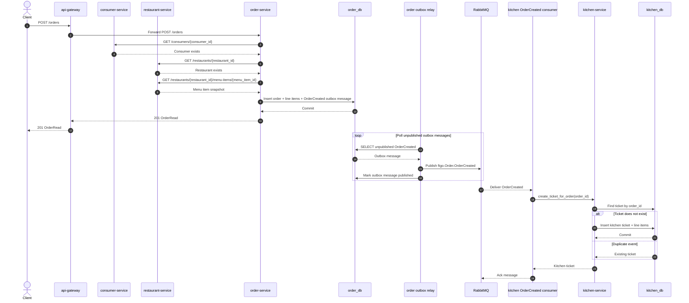

# Place Order Use Case

This is the first end-to-end FTGO use case.

## Flow

1. Create a consumer.
2. Create a restaurant with menu items.
3. Create an order through the API gateway.
4. `order-service` validates the consumer with `consumer-service`.
5. `order-service` validates the restaurant and menu item with `restaurant-service`.
6. `order-service` stores a pending order using the menu snapshot returned by `restaurant-service`.
7. `order-service` records an `OrderCreated` event in its transactional outbox in the same database transaction.
8. `order-service` outbox relay publishes `OrderCreated` to RabbitMQ.
9. `kitchen-service` consumes `OrderCreated` and creates a kitchen ticket idempotently.

## Sequence



## Example

If the local stack is running, execute the full flow with:

```bash
make demo-place-order
```

Or run the steps manually:

Create a consumer:

```bash
curl -s -X POST http://localhost:8000/consumers \
  -H 'content-type: application/json' \
  -d '{
    "email": "alice@example.com",
    "first_name": "Alice",
    "last_name": "Wang",
    "addresses": [{
      "label": "home",
      "street1": "123 Main St",
      "city": "Shanghai",
      "state": "Shanghai",
      "postal_code": "200000",
      "country": "CN"
    }]
  }'
```

Create a restaurant:

```bash
curl -s -X POST http://localhost:8000/restaurants \
  -H 'content-type: application/json' \
  -d '{
    "name": "Noodle House",
    "slug": "noodle-house",
    "cuisine": "Chinese",
    "menu_items": [{
      "name": "Beef Noodles",
      "description": "Classic bowl",
      "price": "28.00"
    }]
  }'
```

Create an order:

```bash
curl -s -X POST http://localhost:8000/orders \
  -H 'content-type: application/json' \
  -H 'Idempotency-Key: order-alice-001' \
  -d '{
    "consumer_id": "<consumer-id>",
    "restaurant_id": 1,
    "currency": "USD",
    "delivery_address": "123 Main St, Shanghai, 200000",
    "line_items": [{
      "menu_item_id": 1,
      "quantity": 2
    }]
  }'
```

The order response includes the menu item name and price from `restaurant-service`.
If the consumer, restaurant, or menu item does not exist, `order-service` rejects
the order instead of storing an invalid reference.
When the order is accepted, the order row and its `OrderCreated` outbox message
are committed together so downstream services can consume the event later.

After the event is published and consumed, the kitchen ticket can be queried:

```bash
curl -s http://localhost:8000/kitchen/tickets | python -m json.tool
```

To verify the whole flow:

```bash
make e2e-place-order
```

### Idempotency

Pass `Idempotency-Key` header to avoid duplicate orders on network retries.
The key is scoped to the consumer and cached in-memory for 1 hour.
